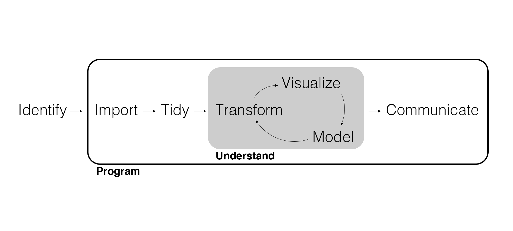
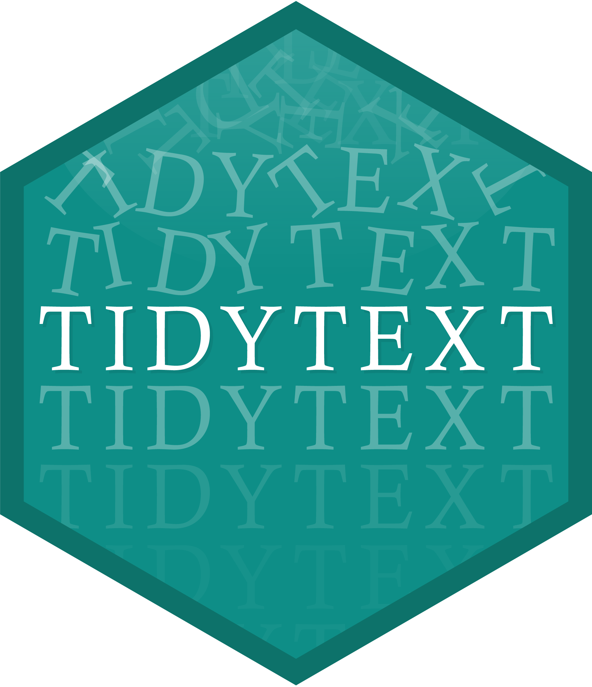

## Spiritual Thought

"If you do feel filled with [Christ's] love in this season of your life, please try and hold on to it as effectively as a sieve holds water..."

[Have you ever tried to carry water in a sieve?](https://www.youtube.com/watch?v=CBbhbuPb6ZA)

"Let's look for and treasure experiences of feeling His love and power in our lives. The joy of the gospel is available to all: not just the happy, not just the downcast. Joy is our purpose, not the gift of our circumstances."

Karl D. Hirst: "God's Favourite", October 2024 General Conference

## Motivation

* Imagine you work for a mid-sized hotel chain.
* Your supervisor says they want a report on what customers like/dislike about staying at your hotels.
* How would you create this report?

## Motivation

* Imagine you work for a mid-sized hotel chain.
* Your supervisor says they want a report on what customers like/dislike about staying at your hotels.
* How would you create this report?
* As a Marketer, what do we ACTUALLY want to be able to do with this information?

## Translation:

Provide your supervisor with some *actionable* recommendations based on customer sentiment themes.

* **Highlight what is working**: if we find that *staff friendliness* and *location* are viewed positively, these can be featured in our ads.
* **Fix what is broken**: if *noise levels* and *cleanliness* are associated with negative sentiment, these may be areas for operational improvement.

## Marketing Analytics Process

<center>
{width=900px}
</center>

---

{width=500px}

## Text Data

We've done a bit of **natural language processing** (NLP) previously. The basic approach we've already used is called **bag of words**, where each token (what we create when we *tokenize*) is a word.

- Each word is a **token**.
- Each unique word is a **term**.
- A **document** is written by an author.
- A collection of documents is a **corpus**.

By counting the tokens for each term, we produce word counts that we can visualize. We can use word counts to apply *unsupervised learning* techniques to find **topics**.

## Install packages!

* `topicmodels`
* `wordcloud`

## Load Packages

```{r message=FALSE}
# Load packages.
library(tidyverse)
library(tidytext)
library(topicmodels)
library(dbplyr)
library(DBI)

seed_num <- 42
```

## Import Data

```{r}
roomba_reviews <- read_csv(here::here("Data", "roomba_reviews.csv"))
```

## Tokenize, Remove Stop Words, and Visualize

Like we did previously, let's tokenize, remove stop words, and visualize word counts.

```{r eval=FALSE}
# Tokenize and remove stop words.
tidy_reviews <- roomba_reviews |>
  mutate(review_id = row_number()) |> 
  unnest_tokens(word, Review) |> 
  anti_join(stop_words, join_by(word))

# Visualize word counts.
tidy_reviews |> 
  count(word) |> 
  arrange(desc(n)) |> 
  slice(1:10) |> 
  mutate(word = fct_reorder(word, n)) |>
  ggplot(aes(x = n, y = word)) +
  geom_col()
```

---

```{r echo=FALSE}
# Tokenize and remove stop words.
tidy_reviews <- roomba_reviews |>
  mutate(review_id = row_number()) |> 
  unnest_tokens(word, Review) |> 
  anti_join(stop_words, join_by(word))

# Visualize word counts.
tidy_reviews |> 
  count(word) |> 
  arrange(desc(n)) |> 
  slice(1:10) |> 
  mutate(word = fct_reorder(word, n)) |>
  ggplot(aes(x = n, y = word)) +
  geom_col()
```

## Word Clouds

Word clouds are just word counts.

```{r}
tidy_reviews |> 
  count(word) |> 
  with(wordcloud::wordcloud(words = word, freq = n, max.words = 30))
```

## Topic Modeling

Word frequencies *suggest* overall meaning, but we would like to uncover the different **topics** being written about. This is especially true as the size of a corpus increases.

- Topic models uncover groups of words (i.e., topics) via *unsupervised learning*.
- The most common topic model is called **latent Dirichlet allocation** or LDA.

Where cluster analysis is based on distance between observations, topic modeling is based on word counts. While clustering assigns each observation to a cluster, topic modeling identifies every document as a mixture of topics.

## Fit LDA

The input for a topic model is a **document term matrix** (DTM). Let’s "cast" our tidy data into a DTM.

```{r}
# Create a DTM.
dtm_reviews <- tidy_reviews |>
  count(word, review_id) |>
  cast_dtm(review_id, word, n)

dtm_reviews
```

---

Fitting a topic model is straightforward with a DTM.

```{r}
# Fit a topic model.
set.seed(seed_num)
fit_lda2 <- dtm_reviews |> 
  LDA(k = 2, method = "Gibbs")

fit_lda2
```

## Hyperparameter Tuning

We'd like to tune `k` similar to what we did with clustering.

```{r}
# Tune k.
fit_tune <- tibble(num_topics = 2:10) |>
  mutate(
    fit_lda = pmap(
      list(k = num_topics), 
      LDA, 
      x = dtm_reviews, method = "Gibbs"
    ),
    model_fit = map(fit_lda, logLik) |> as.numeric()
  )
```

---

Now we can plot the model fit statistics to determine what `k` might be set to, though it still requires a subjective evaluation of a range of possible models.

```{r fig.width=6, fig.height=4}
ggplot(fit_tune, aes(x = num_topics, y = model_fit)) +
  geom_point() + 
  geom_line()
```

## Evaluate Topics

The most important output from a topic model are the topics themselves: the dictionary of words, sorted according to the **probability** the word is part of that topic.

Let's tidy these probabilities (i.e., betas).

```{r eval=FALSE}
# Fit a final topic model.
fit_lda6 <- dtm_reviews |> 
  LDA(k = 6, method = "Gibbs")

# Produce probabilities.
tidy(fit_lda6, matrix = "beta") |> 
  arrange(desc(beta))
```

---

```{r echo=FALSE}
# Fit a final topic model.
fit_lda6 <- dtm_reviews |> 
  LDA(k = 6, method = "Gibbs")

# Produce probabilities.
tidy(fit_lda6, matrix = "beta") |> 
  arrange(desc(beta))
```

---

Now we can visualize our topics.

```{r eval=FALSE}
fit_lda6 |> 
  tidy(matrix = "beta") |>
  group_by(topic) |> 
  top_n(8, beta) |>
  ungroup() |>
  mutate(term = reorder_within(term, beta, topic)) |>
  ggplot(aes(x = beta, y = term, fill = as.factor(topic))) +
  geom_col(show.legend = FALSE) +
  facet_wrap(~ topic, scales = "free") +
  scale_y_reordered()
```

---

How would you name these topics?

```{r echo=FALSE}
fit_lda6 |> 
  tidy(matrix = "beta") |>
  group_by(topic) |> 
  top_n(8, beta) |>
  ungroup() |>
  mutate(term = reorder_within(term, beta, topic)) |>
  ggplot(aes(x = beta, y = term, fill = as.factor(topic))) +
  geom_col(show.legend = FALSE) +
  facet_wrap(~ topic, scales = "free") +
  scale_y_reordered()
```

## Map Documents to Topics

You can examine the reviews assigned to each topic for additional context.

```{r}
# extract topic classification for each document from the model
# note that documents can contain multiple topics - here we only
# see the most likely
topic_classifications <- tibble(
  doc_number = as.numeric(names(topics(fit_lda6))),
  topic_number = topics(fit_lda6)
)

# join the topic classifications to the original review data
roomba_reviews <- roomba_reviews |>
  mutate(doc_number = 1:n()) |>
  left_join(topic_classifications, join_by(doc_number)) |>
  drop_na(topic_number)
```

---

Look for documents classified to Topic 6.

```{r}
roomba_reviews |>
  filter(topic_number == 6) |>
  select(Review)
```

---

Look for documents classified to Topic 2.

```{r}
roomba_reviews |>
  filter(topic_number == 2) |>
  select(Review)
```

## Other Options?

Topic models are great - but do we have another tool that is adept at analyzing large amounts of text?

## CV/Resume

- Statistical programming in R.
- Wrangle and visualize data.
- Query databases.
- Build dashboards.
- Use regression models for inference.
- Use machine learning models for prediction.
- Employ clustering to segment consumers.
- Run topic modeling.
- Produce and communicate results in terms of business insights.

## What Next?

- Read supplementary texts.
- Whenever you use Excel, use R instead (or as well).
- Consider taking MKTG 585R and stats classes.
- Sign up for on-campus internships.
- Learn additional (programming) languages.

## Wrapping Up

*Summary*

- Used NLP, including reviewing tokenizing and removing stop words, sentiment analysis, and topic modeling.
- Discussed what to add to your CV and recommendations for next steps.

*Next Time*

- Project week!

*Supplementary Material*

- *Text Mining with R*

## Exercise 22

1. Run a topic model with three topics in `roomba_reviews`.
2. Visualize the topics and name them. Justify your names.
3. Render the Quarto document into Word and upload to Canvas.
